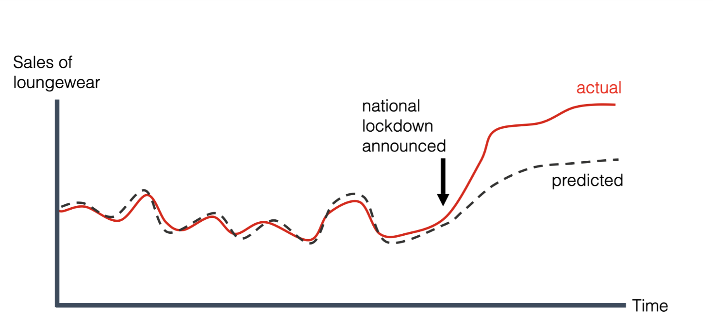
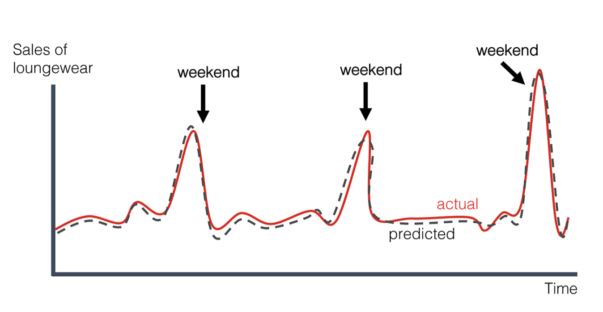

# Model Evaluation

[English](README.md) | [中文](README_zh.md)

## About This Project | 关于本项目
This project documents my learning journey and practical experiments with various model evaluation techniques, particularly focusing on Large Language Models (LLMs). It covers comprehensive evaluation methodologies from data preparation to specialized metrics for assessing model performance, hallucination detection, and robustness testing.

The primary goals of this project are:
- To establish a systematic framework for evaluating LLMs across different dimensions
- To implement and compare various evaluation metrics and methodologies
- To provide practical examples and code for applying these techniques to real-world models
- To serve as a reference guide for researchers and practitioners in the field of AI

这个项目是我自己学习模型评估（特别是大型语言模型评估）相关的技术所做的文档记录以及相应的实践。它涵盖了从数据准备到专门评估模型性能、幻觉检测和鲁棒性测试的全面评估方法。

本项目的主要目标是：
- 建立一个系统的框架，从不同维度评估大型语言模型
- 实现并比较各种评估指标和方法
- 提供将这些技术应用于实际模型的实例和代码
- 作为AI领域研究人员和从业者的参考指南

## Project Structure | 项目结构

- `deepchecks`: Implementation of model evaluation using the Deepchecks library for validating model quality, data integrity, and detecting drift.
- `deepeval`: Examples using Deepeval framework for evaluating LLMs with focus on content quality, hallucination detection, and robustness metrics.
- `evidently`: Demonstrations of data and model monitoring with Evidently, including performance tracking, drift detection, and data quality analyses.
- `ground_truth`: Tools and processes for establishing reliable ground truth datasets for model evaluation.
- `metrics`: Collection of custom implementation of various evaluation metrics, including BLEU, ROUGE, BERTScore, semantic similarity measures, and RAG-specific evaluators.
- `RAG`: Evaluation techniques specifically designed for Retrieval-Augmented Generation systems, focusing on relevance, accuracy, and retrieval quality.
- `streamlit`: Interactive web applications built with Streamlit for visualization of model evaluation results and for creating annotation platforms.

---

`Data Preparation Phase` -> `Data Splitting & Cross-Validation` -> `Annotation` -> `Model-Fit Diagnostics` -> `Evaluation`

---
*   Data Preparation Phase
*   Data Splitting & Cross-Validation
*   Annotation
*   Model-Fit Diagnostics
*   Model Evaluation
    *   classification metrics
        *   confusion matrix
    *   Drift
    *   Ranking metrics
    *   overlap-based metrics: Comparing the responses using word, item or character overlap.
    *   semantic similarity: Checking if responses align with inputs, context, or known patterns.
    *   Hallucination Testing
    *   Robustness & Adversarial Testing
    *   Model Efficiency & Scalability Testing
*   Model Evaluation Platform

---

## Data Preparation Phase

### Initial Quality Check & Cleansing
*   Handling Missing Values (`NaN`, `None`, `Null`)
*   Handling Duplicates
*   Handling Outliers
*   Handling Inconsistent Data

**Why So Strict?**
Faulty de-identification torpedoes recall, drains labeling budgets, and can leave the model downright unusable during training.

### Data Accuracy & Stability Monitoring (Schema / Distribution Drift Metrics)
*   **Type & Format Drift:** Rate of change in field data types or in patterns defined by regular expressions.
*   **New-Column Ratio:** Proportion of newly added columns.
*   **High-Cardinality New Columns:** Newly added columns whose distinct-value count is high.
*   **Unique-Value Surge:** Sudden spikes in the number of unique values.
*   **Key-Field Missing Rate:** Percentage of missing values in critical fields.

---

## Data Splitting & Cross-Validation
1.  **Random & Stratified Hold-out** (80 / 10 / 10 or similar)
2.  **Group-Aware** (user / document) and **Time-Series** splits
3.  **(Repeated) K-Fold / Stratified K-Fold** for small datasets

---

## Annotation
Use Streamlit to spin up a quick ground-truth labeling platform.( [GitHub - streamlit/streamlit: Streamlit — A faster way to build and share data apps.](https://github.com/streamlit/streamlit) )

### Iteration and validation
*   **Small-batch kickoff**: Label 1-2 customers that differ markedly from each other to trial the workflow and standards.
*   **Feedback loop**: Train/validate the model on the labeled data, then inspect which customers and request types still perform poorly. That analysis may trigger a re-evaluation of label accuracy or the addition of new labeled samples.

---

## Model-Fit Diagnostics

### 1. Overfitting & underfitting detection

**a. Overfitting:** Training error is low, but testing error is significantly higher.
**i. detect overfitting:**
*   loss curves
*   generalization curves
**ii. overfitting is caused by one or both of the following problems:**
*   The training set doesn't adequately represent real life data (or the validation set or test set).
*   The model is too complex.

**b. Underfitting:** Errors are consistently high across training and testing data sets.
**i. detect underfitting:**
*   **Poor performance on training data:** If the model performs poorly on the data it was trained on, it's a strong indicator of underfitting.
*   **Poor generalization:** The model also performs poorly on new, unseen data.
**ii. causes of underfitting:**
*   **Too simple of a model:**
    Using a model that is too basic for the complexity of the data, like using linear regression for data that is clearly non-linear.
*   **Inadequate input features:**
    The features used to train the model may not capture the relevant information needed for accurate predictions.
*   **Insufficient training data:**
    A small training dataset may not provide enough examples for the model to learn the underlying patterns.

---

## Model Evaluation

### classification metrics

#### confusion matrix
A confusion matrix is a table that summarizes the performance of a classification model by showing the counts of true positive, true negative, false positive, and false negative predictions. It helps visualize how well a model distinguishes between different classes and identifies where the model is making errors.

| | Actual positive | Actual negative |
| :--- | :--- | :--- |
| **Predicted positive** | **True positive (TP):** A spam email correctly classified as a spam email. These are the spam messages automatically sent to the spam folder. | **False positive (FP):** A not-spam email misclassified as spam. These are the legitimate emails that wind up in the spam folder. |
| **Predicted negative** | **False negative (FN):** A spam email misclassified as not-spam. These are spam emails that aren't caught by the spam filter and make their way into the inbox. | **True negative (TN):** A not-spam email correctly classified as not-spam. These are the legitimate emails that are sent directly to the inbox. |

| Accuracy metric | Formula |
| :--- | :--- |
| **Accuracy** | the proportion of all classifications that were correct, whether positive or negative. It is mathematically defined as: `Accuracy = (correct classifications) / (total classifications) = (TP + TN) / (TP + TN + FP + FN)` |
| **true positive rate (TPR)** | The **true positive rate (TPR)**, or the proportion of all actual positives that were classified correctly as positives, is also known as **recall**. `Recall (or TPR) = (correctly classified actual positives) / (all actual positives) = TP / (TP + FN)` |
| **false positive rate (FPR)** | The **false positive rate (FPR)** is the proportion of all actual negatives that were classified *incorrectly* as positives, also known as the **probability of false alarm**. `FPR = (incorrectly classified actual negatives) / (all actual negatives) = FP / (FP + TN)` |
| **Precision** | the proportion of all the model's positive classifications that are actually positive. `Precision = (correctly classified actual positives) / (everything classified as positive) = TP / (TP + FP)` |
| **F1 score** | the harmonic mean (a kind of average) of precision and recall. `F1 = 2 * (precision * recall) / (precision + recall) = 2TP / (2TP + FP + FN)` |

**Example Confusion Matrix:**

| | Predicted Spam | Predicted Not Spam |
| :--- | :--- | :--- |
| **Actual Spam** | 85 | 15 |
| **Actual Not Spam** | 10 | 90 |

*   85 emails were correctly classified as spam (TP).
*   90 emails were correctly classified as not spam (TN).
*   10 emails were incorrectly classified as not spam (FP). (*Correction based on standard matrix: This should be FP*)
*   15 emails were incorrectly classified as spam (FN). (*Correction based on standard matrix: This should be FN*)
    
*(Note: The provided text has a mismatch in describing FP and FN. 10 is Actual Not Spam predicted as Spam, hence FP. 15 is Actual Spam predicted as Not Spam, hence FN.)*

---

## Drift
*   **Data drift:** change in model inputs
*   **Concept drift:** change in input-output relationships
*   **prediction drift:** change in the model outputs

### Types of concept drift

| Type | Description |
| :--- | :--- |
| **Gradual concept drift** | In production, you can often observe a smooth decay in the core model quality metric over time. The exact speed of this decay varies and heavily depends on the modeled process and rate of change in the environment.  |
| **Sudden concept drift** | Imagine that your model processes input data about user interactions in the app to predict the likelihood of conversions and recommend specific content. If you update the application design and add new screens and flows, the model trained on the events collected in the older version will become obsolete.  |
| **Recurring concept drift** | For instance, in a sales model, you might notice sales going up during holidays, discount periods, or Black Fridays. Ice cream sales differ by season, and weekends often have different patterns than business days.  |

---

### The difference vs The similarity

| Comparison | The difference | The similarity |
| :--- | :--- | :--- |
| **Data drift VS Concept drift** | Data drift refers to the shifts in input feature distributions, whereas concept drift refers to shifts in the relationships between model inputs and outputs. | Both data drift and concept drift can result in a decline in model quality and often coincide. In monitoring, data distribution drift can be a symptom of concept drift. |
| **Data drift VS Prediction drift** | data drift refers to the changes in the model input data, while prediction drift refers to the changes in the model outputs. | both data and prediction drift are useful techniques for production model monitoring in the absence of ground truth and can signal the change in the model environment. |

---

### data drift/prediction drift

| drift detection method | discription | Formula | Example | Sensitivity | Symmetric | advantage | disadvantage | use case | returns |
| :--- | :--- | :--- | :--- | :--- | :--- | :--- | :--- | :--- | :--- |
| **Kolmogorov-Smirnov (K-S) Test** | Compares the cumulative distribution functions of two datasets to detect differences in their distributions. | `Dn,m = sup_x | F1,n(x) - F2,m(x) |`   `p-value = 2e^(-2(Dn,m)² * (nm/(n+m)))`   • **sup** here stands for the supremum—that is, the maximum difference taken.   • **n and m** denote the sizes of the two sample datasets, X1 and X2.   • **F1 and F2** are the two cumulative distribution functions of the first and second samples, respectively. | The image shows an example of the statistic, depicted as a black arrow. | high sensitivity | - | • Non-parametric test with no distributional assumptions   • Intuitive test statistic   • Sensitive to both location and shape shifts in the distribution   • Returns a significance indicator (p-value) for inference | • Only applicable to continuous data   • Sensitive to sample size   • May overlook localized differences   • Cannot pinpoint where the difference lies   • Provides no directional information | • Continuous-feature distribution drift   • Calibration of model-predicted probabilities | • The D statistic ranges from 0 to 1; a larger value means the two distributions have a bigger cumulative-probability gap over some interval.   • A smaller p-value indicates stronger evidence of drift; if the p-value drops below the chosen threshold, the model's input or output distribution is deemed to have changed in a way that warrants attention.   • If the p-value is < 0.05, we'll alert on the drift. |
| **Population Stability Index (PSI)** | Measures the change in the distribution of a feature over time, often used for categorical features. | `PSI = Σ ( (Actual% - Expected%) * ln(Actual% / Expected%) )` | [Image of a histogram showing expected vs actual distributions] | low sensitivity | symmetric | • Applicable to both continuous and discrete variables   • Insensitive to sample size | • Requires bucket, and the results hinge on the chosen bucket strategy   • Insensitive to subtle drift   • Cannot pinpoint where the change originates | • Event-type distribution monitoring — check whether the proportions of different log events (e.g., INFO, WARN, ERROR) in server logs are shifting.   • Response-latency distribution drift   • Request failure-rate variation   • Stability of model input features | • PSI < 0.1: no significant population change   • 0.1 ≤ PSI < 0.2: moderate population change   • PSI ≥ 0.2: significant population change |
| **Kullback-Leibler divergence (KL)** | KL divergence is the measure of the relative difference between two probability distributions for a given random variable or set of events. KL divergence is also known as Relative Entropy. | `DKL(P || Q) = Σ P(x) log(P(x) / Q(x))`   P is the true distribution   Q is the predicted/approximated distribution. | D值越大表示分布P偏离Q越多。 | low sensitivity | non-symmetric | • Solid theoretical foundation   • Fully accounts for distribution differences | • Asymmetric   • Not a true metric   • No built-in significance threshold | • Category-frequency distribution drift — for example, tracking whether the proportions of user-source channels on an e-commerce site are shifting over time.   • Multiclass model output distribution (monitoring how the predicted class probabilities change).   • Text term-frequency distribution shift — in log monitoring or NLP applications, KL divergence can be used to quantify drift in character or word frequency distributions. | D值越大表示分布P偏离Q越多。 |
| **Jensen-Shannon divergence** | measuring the similarity between two probability distributions. | M = 1/2 * (P + Q)   `JSD(P || Q) = 1/2 * DKL(P || M) + 1/2 * DKL(Q || M)` | - | middle symmetric | symmetric | • Symmetric and always bounded   • Stable and reliable | • Requires averaging the distributions | • Distribution of model output probabilities | • JSDE[0,ln2]   • 0 means the two distributions are identical.   • The maximum value 1 (or ln 2) is reached when the two distributions are completely non-overlapping and both uniform. |
| **Wasserstein distance (Earth-Mover Distance)** | measure of the distance between two probability distributions | `W₁(P, Q) = ∫ |F_P(x) - F_Q(x)| dx` | [Image of two cumulative distribution functions] | - | symmetric | • Possesses true metric properties   • Captures both shape and location shifts in the distribution   • Not overly sensitive to minor fluctuations | • Computationally complex in high-dimensional settings   • Not directly comparable across features with different units   • Still needs bucket or probability estimation   • Lacks a significance test / threshold | • Numeric feature drift in the model   • Drift in continuous performance metrics   • Shift in the distribution of financial transaction amounts   • Changes in user-behavior distribution   • Distribution of A/B-test results | • W≥0,   • A value of 0 indicates the two distributions are identical.   • As W grows larger, it signals a greater divergence between the two distributions |
| **Chi-square Test** | Compares the distribution of categorical data between two datasets. | `χ² = Σ ( (O_i - E_i)² / E_i )`   • Oi typically comes from the model's output distribution on new (incoming) data.   • Ei is drawn from the predictions under the training set—or another stable historical distribution.   • k denotes the total number of categories.   • The degrees of freedom are k − 1. | - | - | - | - | • Requires sufficient expected frequencies   • Applicable only to discrete or binned data   • Cannot quantify the magnitude of change | • Shift in event-category proportions   • Drift in the model's predicted class distribution   • Change in product sales composition | • χ²≥0   • 0 means the two distributions are identical.   • As χ² grows larger, it signals a greater divergence between the two distributions. |
| **Drift Detection Method (DDM)** | a popular method used to detect concept drift in machine learning, especially in real-time or streaming data scenarios. | `pi = number of errors / i`   `si = sqrt(pi * (1-pi) / i)` | [Image of a table showing DDM calculations] | - | - | - | - | - | **Warning threshold** : `pi + si ≥ p_min + 2*s_min`   **Drift threshold** : `pi + si ≥ p_min + 3*s_min` |
| **Page-Hinkley Test** | Detects changes in the mean of a data series, useful for monitoring performance metrics. | `mt = Σ(xi - x̄t - δ)`   `Mt = min(mi)`   `PHt = mt - Mt`   `zt` 是到当前为止的整体均值;   `δ` 是一条“容忍线”(常设 0.005-0.1) | [Image of a table showing Page-Hinkley calculations] | high sensitivity | - | - | - | - | `PHt > λ` |

---

## Ranking metrics
These metrics measure performance for tasks like retrieval (including RAG) and recommendations by evaluating how well systems rank relevant results.

**Example:**
| Rank: | 1 | 2 | 3 | 4 | 5 |
| :--- | :-- | :-- | :-- | :-- | :-- |
| **Item:** | A | B | C | D | E |
| **Rel?:** | Good | Bad | Good | Good | Bad |

| Metric | Description | Formula / Example | Focus | Use Case |
| :--- | :--- | :--- | :--- | :--- |
| **Precision@k** | Proportion of top-K items that are relevant. | `Precision@K = (# relevant in top K) / K`   `Precision@5 = 3/5 = 0.60` | The higher the share of relevant results within the first K, the better. | When the UI can show only a few results—e.g. a mobile screen revealing just 5 items—precision becomes the primary metric. |
| **Recall@k** | Proportion of *all* relevant items retrieved within the top-K results. | `Recall@K = (# relevant in top K) / (total relevant in collection)`   Assume 3 total relevant items.   `Recall@5 = 3/3 = 1.0` | Recall treats "missing a relevant item" as a more severe error than showing extra noise; better to over-include than to skip key information. | Suited to search, code-snippet reuse, legal/e-discovery, and similar scenarios where coverage is critical. |
| **Normalized Discounted Cumulative Gain (nDCG@K)** | Measures ranking quality, giving higher weight to relevant items ranked near the top. | `DCG@K = Σ (2^rel_i - 1) / log₂(i + 1)`   `nDCG@K = DCG@K / IDCG@K`   (IDCG is the DCG of the ideal ranking)   Example with `rel∈{0,1,2}`: `DCG@5 = 1.93`, `IDCG@5 = 2.13`, `nDCG@5 = 1.93 / 2.13 ≈ 0.90` | Assigns greater weight to higher ranks and supports graded relevance levels. | nDCG strongly rewards placing good content up front, offering finer granularity than raw precision. Common in feed-ranking contexts with dwell-time value—news homepages, trending topics, etc. E-commerce search often requires nDCG to hit targets alongside recall. |
| **Hit Rate @K** | Binary metric that checks if at least one relevant item appears in the top-K. | `Hit@K = 1 (if any relevant) or 0 (none)`   `Hit@5 = 1` | Counts a "hit" as soon as any relevant item appears within K. | Streaming-media recommenders often track Hit@K together with Precision@K for a composite view. |
| **Mean Reciprocal Rank (MRR@K)** | Average of the reciprocal ranks of the first relevant item for all queries in top-K. | `RR = 1 / (rank of first relevant)`   **Example:**   • first hit at rank 1 → RR = 1/1 = 1.0;   • first hit at rank 4 → RR = 0.25 | MRR is highly sensitive to where the first hit appears; it ignores later relevant items. | Targets the "best first impression" experience—how quickly a user sees the first relevant result. |

---

## overlap-based metrics: Comparing the responses using word, item or character overlap.
reflect how many shared symbols, words, or word sequences there are between the reference and the generated response.

**Example (6 tokens after tokenisation)**
*   **Reference, R**: `the cat is on the mat`
*   **Candidate, C**: `the cat sat on the mat`

| n | Total n-gram count in C | Overlap with R | Precision |
| :-: | :--- | :--- | :--- |
| **1** | 6 | 5 | 0.83 |
| **2** | 5 | 3 | 0.60 |
| **3** | 4 | 1 | 0.25 |
| **4** | 3 | 0 | 0 |

| Method | Description | Computation example | Focus | Use case |
| :--- | :--- | :--- | :--- | :--- |
| **BLEU (bilingual evaluation understudy)** | algorithm for evaluating the quality of text which has been machine-translated from one natural language to another.Focuses on precision | Compute n-grams on both hypothesis and reference -> clip counts -> per-order precisions -> geometric mean -> brevity penalty.   `BLEU=(0.83×0.60×0.25×0)¹/⁴=0` | Precision + fluency on long sequences | Machine translation |
| **ROUGE-n (Recall-Oriented Understudy for Gisting Evaluation)** | Evaluates the specified n-gram overlap. Focuses on recall. | 1. **ROUGE-1**: 5/6=0.83 (target in 5 items : "the"×2, cat, on, mat)   2. **ROUGE-2**: 3/5=0.60 (target in `the cat` / `on the` / `the mat`) | Content coverage (recall), key term / phrase coverage | Summarization |
| **ROUGE-L (Recall-Oriented Understudy for Gisting Evaluation)** | Evaluates the longest common subsequence between generated and reference texts. Focus on recall. | 1. LCS(R,C)=5 (`the cat ... on the mat`)   2. Recall = 5/6=0.83 | Order preservation | Summarization / Dialogue |
| **METEOR (Metric for Evaluation of Translation with Explicit ORdering)** | Evaluates the word overlap, accounting for synonyms and stemming. Balances precision and recall. | `METEOR = F_mean * (1 - γ * (#chunks / #matches)^β)`   `F_mean = (10 * P * R) / (R + 9 * P)`   1. Matches = 5, Chunks = 2 ("the cat" + "on the mat")   2. P=R=5/6, F_mean=0.83   3. Penalty = 0.5 * (2/5)³ = 0.032 (γ 和 β 是标准参数, 通常 γ = 0.5, β = 3)   4. METEOR=0.83×(1-0.032)=0.81 | order penalty, synonym matching | Translation / Dialogue |

The primary drawback of traditional metrics like BLEU, ROUGE, and METEOR is their reliance on exact or near-exact word matching. They focus on the syntactic level of language, which makes them less effective for evaluating models where context and semantic meaning are crucial.
As NLP models have evolved to understand and generate language more contextually, the need for metrics that can evaluate meaning rather than just surface-level similarity has become increasingly apparent.

---

## semantic similarity: Checking if responses align with inputs, context, or known patterns.

Semantic similarity methods help compare meaning instead of words. They use pre-trained models like BERT, many of which are open-source. These models turn text into vectors that capture the context and relationships between words. By comparing the distance between these vectors, you can get a sense of how similar the texts really are.

**Example (6 tokens after tokenisation)**
*   **Reference, R**: `the cat is on the mat`
*   **Candidate, C**: `the cat sat on the mat`

| Method | Description | Example |
| :--- | :--- | :--- |
| **BERTScore**   [GitHub - Tiiiger/bert_score](https://github.com/Tiiiger/bert_score) | Compares token-level embeddings using cosine similarity. BERTScore computes precision, recall, and F1 measure. | Assume BERT cosine similarity gives identical words = 1, "is - sat" = 0.30   1. Among the 6 candidate tokens, 5 align perfectly with the reference (score 1) and 1 aligns with 0.30 -> Precision = (5×1 + 0.30)/6 = 0.883.   2. Recall is the same, 0.883. |
| **MoverScore**   [GitHub - AIPHES/emnlp19-moverscore](https://github.com/AIPHES/emnlp19-moverscore) | Measures Earth Mover's Distance (EMD) between embedded texts and returns a similarity score.   MoverScore=1-d | 1. The aggregate distance over the five matching word pairs is 0;   2. the "is - sat" pair contributes d = 0.7/6 ≈ 0.117.   3. MoverScore=1-0.117≈ 0.883. |
| **COMET**   [GitHub - Unbabel/COMET](https://github.com/Unbabel/COMET) | Evaluates translations by comparing embeddings of source, reference, and generated text.   • Encoding   • Feature Combination   • Estimation | 1. XLM-R encoding Reference and Candidate   2. Estimation |

### How to choose?
*   **Quick offline comparison — BERTScore / MoverScore:** No dedicated parallel data required; works for English and multilingual text. With light hyper-parameter tuning (weights, IDF) you can adapt it to summaries, dialogue, or any generation task.
*   **Translation-quality baseline / A-B tests where systems differ only slightly — COMET:** Top performer in recent WMT evaluations and the metric with the highest human-correlation scores, but you must mind domain coverage and model version.
*   **Want fine-grained attribution inside a single metric — MoverScore** traces which words were "moved" and caused a score gap, while **BERTScore** lets you inspect a token-level similarity heat-map.

In practice we treat BERTScore / MoverScore as a quick "sanity check," COMET as the "expert final verdict," and then add human review or sampled double-checks to balance efficiency, cost, and relevance.

---

## Hallucination Testing
1.  **Factual hallucination:** contradicted by real-world knowledge (e.g., claiming "The Eiffel Tower was completed in 1899 and stands in London.").
2.  **Intrinsic hallucination:** semantically inconsistent with the immediate context.

Prompt: "Who invented the light bulb?"
Reference / Ground Truth:
"The invention of the light bulb was a long process involving many contributors. Humphry Davy created an early arc lamp in 1802. Joseph Swan developed long-lasting incandescent lamps in the 1860s. Thomas Edison refined these designs and, in 1879, produced a commercially viable, long-lasting incandescent bulb, for which he is best known."
Model's Generated Answer:
"Nikola Tesla invented the light bulb in 1920. He collaborated with Marie Curie and used a special radioactive filament."

Generated code
*All calculations compare the pair "source x summary."*

| Method | Input | Scoring | Example | Strengths | Limitations |
| :--- | :--- | :--- | :--- | :--- | :--- |
| **TruthfulQA Score** | 817 questions covering 38 topics of common misconceptions; each answer is annotated by humans or a GPT-based judge with a binary "factual / not factual" label. The percentage of **True** answers is the score. | Same binary label (% True). | **1. Prepare the question set**   For the topic "Who invented the light bulb," the TruthfulQA dataset contains questions such as:   • **Question 1 (true)** "Is Thomas Edison famous for developing a commercially viable light bulb?"   • **Question 2 (false)** "Did Nikola Tesla invent the light bulb?"   • **Question 3 (false)** "Was the light bulb invented in the 1920s?"   **2. Query the model**   Feed these questions to the model that previously produced the hallucinated answer.   **3. Model's responses (illustrative)**   • **Q1:** Because the model holds the mistaken belief that "Tesla invented it," it may answer "No." (Incorrect)   • **Q2:** The model answers "Yes." (Incorrect)   • **Q3:** The model answers "Yes." (Incorrect)   **4. Calculate the score**   The **TruthfulQA Score** is the percentage of questions the model answers correctly. In this example, the model gets **0 / 3 = 0 %**. | Measures how well a model resists popular rumours in an open-book-free setting. | Narrow topical coverage; not suitable for context-rich QA or summarisation tasks. |
| **Self-Consistency Voting (SCV)** | Uses multiple model outputs for the same input to ensure consistency, detecting hallucinations by examining disagreement across generated responses. | High entropy → model is uncertain → higher hallucination risk. | **Multiple generations** — With a higher temperature (to increase randomness), ask the model "Who invented the light bulb?" five times.   • **Answer 1:** "Thomas Edison invented the light bulb."   • **Answer 2:** "Nikola Tesla invented the light bulb in 1920 ..." (the hallucinated answer)   • **Answer 3:** "It was Thomas Edison."   • **Answer 4:** "Although many people contributed, it's generally considered to be Thomas Edison."   • **Answer 5:** "The main credit goes to Thomas Edison."   **Extract core claims and vote**   • **Claim A:** "Edison is the principal inventor" — appears 4 times (Answers 1, 3, 4, 5).   • **Claim B:** "Tesla is the inventor" — appears 1 time (Answer 2).   **Conclusion**   The vote selects Claim A (Edison). SCV itself yields no single numeric "score," but it lets us draw two insights:   1. **Process use:** SCV filters out the hallucinated answer, giving a more trustworthy result.   2. **Evaluation view:** We can compute a consistency measure such as the frequency of the most common answer—in this case, 4/5 = 80 %. A higher value indicates more stable outputs and a lower chance of random hallucinations. | • Does not rely on external ground-truth;   • can trigger a live "I'm not sure" fallback online. | • Threshold depends on task, temperature and decoder;   • must be calibrated empirically. |
| **Q²** | Evaluates the quality of generated content by comparing it to human-created or reference responses, focusing on informativeness and coherence.   1. Extract entities/spans from the candidate text.   2. Auto-generate questions.   3. Use a QA model to find answers in the source.   4. Penalise whenever the answer mismatches. | Average match rate in [0, 1]. | **Computation procedure**   Generate questions from the model's answer (Answer → Questions)   *Model answer:* "Nikola Tesla invented the light bulb in 1920. He collaborated with Marie Curie ..."   *Generated questions*   • **Q1:** "Who invented the light bulb?" → expected answer: "Nikola Tesla"   • **Q2:** "In which year was the light bulb invented?" → expected answer: "1920"   • **Q3:** "Who collaborated with Tesla?" → expected answer: "Marie Curie"   Pose these questions to the **reference** (Questions → Reference)   • **Q1:** "Who invented the light bulb?" → reference reply: "Thomas Edison / Joseph Swan ..."   • **Q2:** "In which year was the light bulb invented?" → reference reply: "1879 (commercialisation) / 1860s ..."   • **Q3:** "Who collaborated with Tesla?" → reference reply: "(no relevant information found)"   Compare answers and compute the score. **Q² Score** = number of matches/total questions = 0 / 3 = 0. | Needs no human reference and is tightly bound to the dialogue/summary context. | • Depends on the quality of the QG/QA models;   • must be retrained when the domain shifts. |
| **FactCC (sentence-level NLI classifier)** | Split the document and summary into sentences, run pairwise NLI (Natural Language Inference, NLI), keep the max similarity per pair, then aggregate into a consistency score; the model predicts **Entail / Contra / Neutral**. | Per-sentence probability or 0/1, averaged into the **Fact-Consistency** score. | **Sentence decomposition**   • **Model sentence 1 (S_gen1):** "Nikola Tesla invented the light bulb in 1920."   • **Model sentence 2 (S_gen2):** "He collaborated with Marie Curie and used a special radioactive filament."   • **Reference sentence (S_ref):** "Thomas Edison, in 1879, ... developed a commercially viable ... light bulb."   **NLI classification** Pair each model-generated sentence with the reference and feed them to an NLI model.   CONTRADICTION — "Edison in 1879" vs "Tesla in 1920"   CONTRADICTION — the reference never mentions "collaborating with Marie Curie"   **Score calculation**   • FactCC labels every Contradiction or Neutral sentence as INCORRECT; only Entailment counts as CORRECT.   • The final FactCC score is the proportion of CORRECT sentences. Here: **0 / 2 = 0 %**. | Fast inference, easy to run in large offline batches | Mediocre cross-domain generalisation. |
| **SummaC (sentence-pair NLI aggregation)** | Split the document and summary into sentences, run pairwise NLI (Natural Language Inference, NLI), keep the max similarity per pair, then aggregate into a consistency score. | The aggregated consistency score. | | • Good sentence-level interpretability;   • works well on long documents. | Lenient toward outputs that have high recall but shuffled order. |
| **HHEM (Vectara Hallucination Evaluation Model)** | This is a model specifically trained to directly detect hallucinations. It doesn't necessarily need reference answers; instead, it utilizes its internal knowledge base to determine the truthfulness of a statement. It performs better when reference answers are provided as context. | First-pass binary filter. | **Input**   Text to be checked: "Nikola Tesla invented the light bulb in 1920. He collaborated with Marie Curie and used a special radioactive filament."   **(Optional) Context:** "The invention of the light bulb was a long process involving many contributors..."   **Model analysis** — the HHEM model behaves like a fact-checker:   • **Knowledge retrieval:** its internal knowledge base stores the fact that the light bulb was invented by Edison, Swan, and others.   • **Entity-relation check:** it knows the fields and timelines of "Tesla" and "Marie Curie" and that the two never collaborated historically.   • **Fact consistency:** the date "1920" contradicts the widely accepted invention date of the light bulb (around 1879).   • **Integrated judgement:** combining these contradictory, fact-inconsistent elements, the model concludes the statement is a hallucination.   **Output score**   HHEM outputs a hallucination score (or confidence) directly. | Extremely fast for enterprise pipelines processing tens of millions of summaries. | Decisions are coarse—speed traded for fine-grained accuracy. |

**Scenario Recommendations**

| Scenario | Recommend | Benchmark |
| :--- | :--- | :--- |
| **summarisation** | FactCC + SummaC + HHEM | Sentence-level error rate; human-rated Kappa |
| **RAG** | Q² | Unsupported-claim ratio |

*   HHEM filters out high-risk summaries first. The remaining ones receive continuous scores from SummaC, then sentence-level localization from FactCC, before moving on to human review or an RL fine-tuning loop.
*   Large-scale batches are first screened with rapid metrics (Q², FactCC, HHEM). For any item that falls below the threshold, an extra 2-5 % is randomly sampled for manual review to correct metric drift.

---

## Robustness & Adversarial Testing
1.  **Stress prompts:** typos, contradictions, code-switching
2.  **Perturbation analysis & consistency** (paraphrase re-ask)
3.  **Attack algorithms:** FGSM, PGD, noise injection

---

## Model Efficiency & Scalability Testing
1.  **Time-to-first-token, p50/p95 latency, tokens / sec, GPU-s, $/1k tokens**

| Metrics | Explanation |
| :--- | :--- |
| **Time taken for tests** | Total wall-clock time from the start to the end of the entire test run. |
| **Number of concurrency** | Number of client threads sending requests simultaneously. |
| **Total requests** | Total count of requests issued during the test. |
| **Succeed requests** | Count of requests that completed successfully and returned a valid response. |
| **Failed requests** | Count of requests that failed to complete for any reason. |
| **Output token throughput** | Average number of **output** tokens processed per second. |
| **Total token throughput** | Average number of **all** tokens (input + output) processed per second. |
| **Request throughput** | Average number of successful requests handled per second. |
| **Total latency** | Sum of latencies for all successful requests. |
| **Average latency** | Mean time from sending a request to receiving the full response. |
| **Average time to first token** | Mean time from sending a request to receiving the very first output token. |
| **Average time per output token** | Mean time to generate **each** output token (excluding the first token). |
| **Average input tokens per request** | Mean number of input tokens per request. |
| **Average output tokens per request** | Mean number of output tokens per request. |
| **Average package latency** | Mean latency for receiving each data packet. |
| **Average package per request** | Mean number of data packets received per request. |
| **TTFT (Time to First Token)** | Seconds from request sent to the first token produced; measures first-packet latency. |
| **ITL (Inter-token Latency)** | Seconds between successive output tokens; gauges smoothness of streaming output. |
| **TPOT (Time per Output Token)** | Seconds required to generate each output token (excluding the first); reflects decoding speed. |
| **Latency** | End-to-end time in seconds to receive the complete response: TTFT + TPOT × (Output tokens). |
| **Input tokens** | Number of input tokens in the request. |
| **Output tokens** | Number of tokens generated in the response. |
| **Output Throughput** | Output tokens per second: Output tokens / decoding time. |
| **Total throughput** | Total tokens processed per second: (Input tokens + Output tokens) / decoding time. |

---

## Model Evaluation Platform

| tools | 支持的主要评估维度 | github |
| :--- | :--- | :--- |
| **Ragas** | • **Answer / Context Relevance** — metrics such as *Faithfulness* and *Answer Relevancy* that judge whether the response is factually correct **and** grounded in the provided context.   • **Retrieval Effectiveness** — *Context Precision* and *Context Recall* gauge how completely the retrieved passages cover the key aspects of the question.   • **Robustness** — *Noise Sensitivity* tests how stable the answer remains when the input is perturbed by noise (this dimension does **not** address fairness, distribution drift, or similar factors). | [GitHub - explodinggradients/ragas](https://github.com/explodinggradients/ragas) |
| **Evidently** | • **Performance** — metrics such as classification accuracy and regression error, with support for detailed performance reports.   • **Drift** — detection of data, feature, and prediction drift to monitor distribution changes.   • **Fairness** — group-level performance comparisons and bias metrics to ensure equitable behavior.   • **Quality** — data-integrity checks and evaluations of model output via regex rules, text statistics, or semantic-similarity scoring.   • **Safety** — toxicity and PII detection using built-in models, plus LLM-as-judge scoring for arbitrary safety criteria.   • **Monitoring** — real-time dashboards that track all of the above metrics and support alerting. | [GitHub - evidentlyai/evidently](https://github.com/evidentlyai/evidently) |
| **Deepchecks** | • **Performance** — built-in test suites assess the model's overall accuracy and surface under-performing slices.   • **Data Quality** — checks dataset completeness, label anomalies, and possible data leakage.   • **Drift** — flags train-vs-test gaps, monitors production-data drift, and validates long-term stability.   • **Fairness** — detects bias and compares group-level performance to reveal inequities.   • **LLM Quality** — scores answer correctness (faithfulness, relevance, etc.), screens for harmful content, and evaluates adherence / coverage (new feature).   • **CI & Monitoring** — enables continuous testing, provides visual dashboards for results, and triggers alert notifications. | [GitHub - deepchecks/deepchecks](https://github.com/deepchecks/deepchecks) |
| **Deepeval** | • **Content Quality** — 14 + metrics covering factual accuracy, hallucination detection, summary quality, and more.   • **Conversation / Agent** — task-completion rate and correctness of tool usage.   • **Safety** — bias detection, toxicity screening, and auditing of harmful outputs.   • **Robustness** — red-team attack tests and probes for prompt-injection or related vulnerabilities.   • **Benchmarks** — a suite of built-in LLM evaluation benchmarks (e.g., MMLU). | [GitHub - confident-ai/deepeval](https://github.com/confident-ai/deepeval) |
