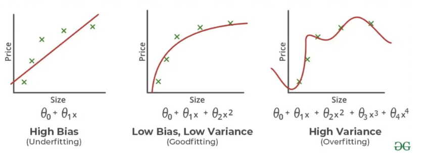
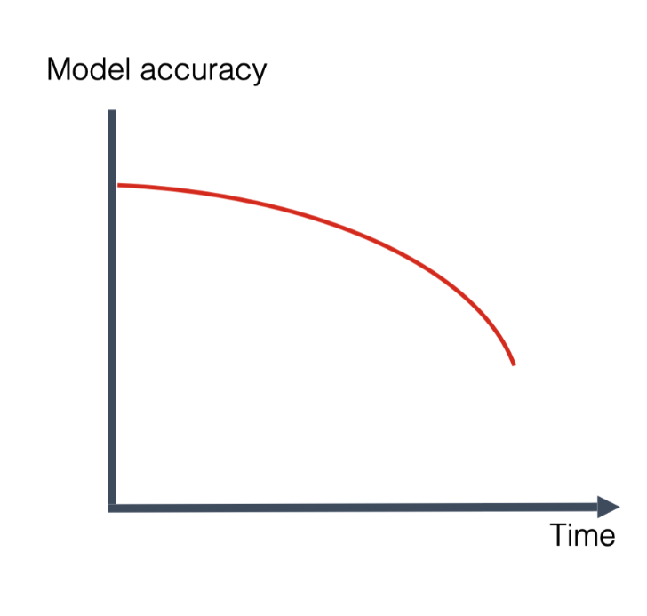
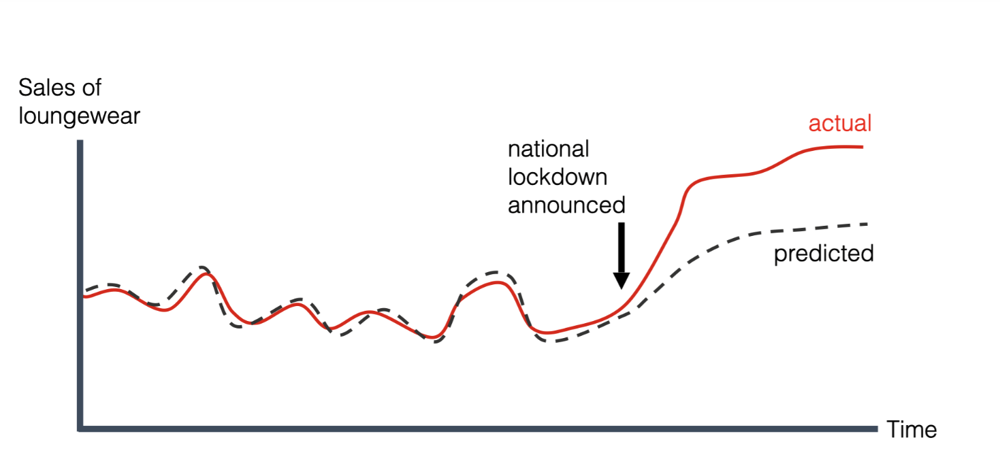
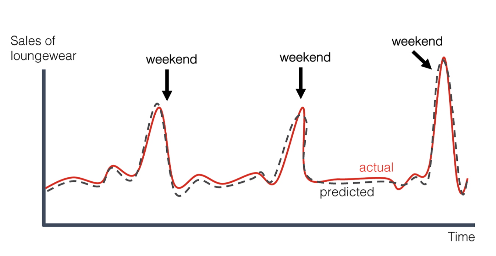
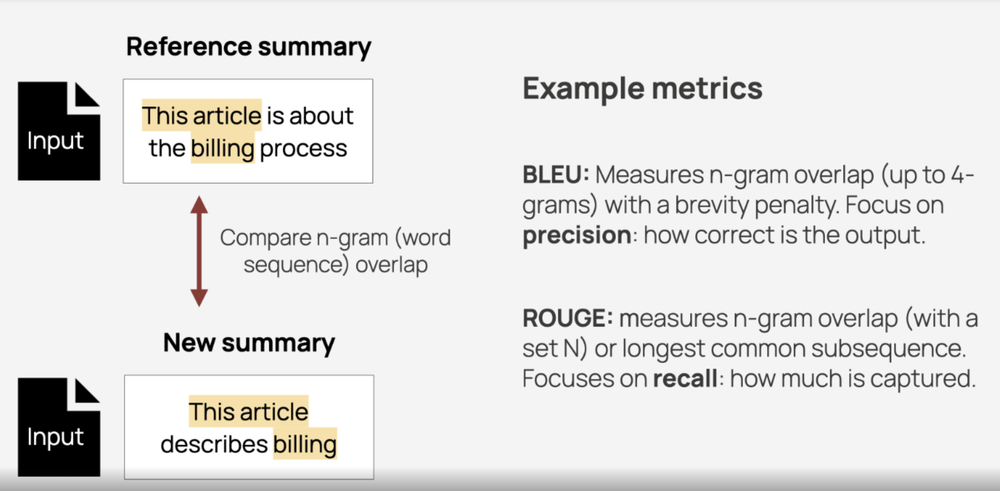
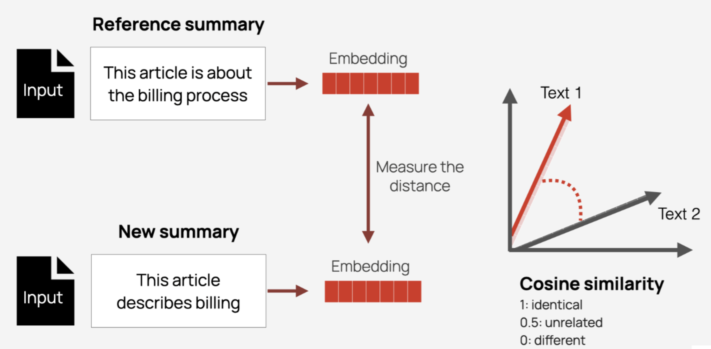

# 模型评估

[English](README.md) | [中文](README_zh.md)

## 关于本项目 | About This Project
本项目记录了我学习和实践各种模型评估技术的过程，特别关注大型语言模型(LLMs)的评估。它涵盖了从数据准备到专门评估模型性能、幻觉检测和鲁棒性测试的全面评估方法。

本项目的主要目标是：
- 建立一个系统的框架，从不同维度评估大型语言模型
- 实现并比较各种评估指标和方法
- 提供将这些技术应用于实际模型的实例和代码
- 作为AI领域研究人员和从业者的参考指南

## 项目结构 | Project Structure

- `deepchecks`: 使用Deepchecks库实现模型评估，用于验证模型质量、数据完整性和检测漂移。
- `deepeval`: 使用Deepeval框架评估LLMs的示例，重点关注内容质量、幻觉检测和鲁棒性指标。
- `evidently`: 使用Evidently进行数据和模型监控的演示，包括性能跟踪、漂移检测和数据质量分析。
- `ground_truth`: 用于建立可靠的基准真相数据集的工具和流程。
- `metrics`: 各种评估指标的自定义实现集合，包括BLEU、ROUGE、BERTScore、语义相似性度量和RAG特定评估器。
- `RAG`: 专为检索增强生成系统设计的评估技术，重点关注相关性、准确性和检索质量。
- `streamlit`: 使用Streamlit构建的交互式Web应用程序，用于可视化模型评估结果和创建标注平台。

---

*   数据准备阶段
*   数据拆分与交叉验证
*   数据标注
*   模型拟合诊断
*   模型评估
    *   分类指标
        *   混淆矩阵
    *   漂移 (Drift)
    *   排序指标
    *   重叠度量指标：通过词、项或字符的重叠来比较响应。
    *   语义相似度：检查响应是否与输入、上下文或已知模式对齐。
    *   幻觉检测
    *   鲁棒性与对抗性测试
    *   模型效率与可扩展性测试
*   模型评估平台

---

`数据准备阶段` -> `数据拆分与交叉验证` -> `数据标注` -> `模型拟合诊断` -> `评估`

---

## 数据准备阶段

### 初始质量检查与清洗
*   处理缺失值 (`NaN`, `None`, `Null`)
*   处理重复项
*   处理异常值
*   处理不一致数据

**为什么如此严格？**
错误的去标识化会严重损害召回率，耗尽标注预算，并可能导致模型在训练期间完全无法使用。

### 数据准确性与稳定性监控 (Schema / 分布漂移指标)
*   **类型与格式漂移 (Type & Format Drift):** 字段数据类型或由正则表达式定义的模式的变化率。
*   **新列比率 (New-Column Ratio):** 新增列的比例。
*   **高基数新列 (High-Cardinality New Columns):** 其唯一值计数很高的新增列。
*   **唯一值激增 (Unique-Value Surge):** 唯一值数量的突然飙升。
*   **关键字段缺失率 (Key-Field Missing Rate):** 关键字段中缺失值的百分比。

---

## 数据拆分与交叉验证
1.  **随机与分层留出 (Random & Stratified Hold-out)** (80 / 10 / 10 或类似比例)
2.  **分组感知 (Group-Aware)** (按用户/文档) 和 **时间序列 (Time-Series)** 拆分
3.  针对小数据集的 **(重复) K-Fold / 分层 K-Fold ((Repeated) K-Fold / Stratified K-Fold)**

---

## 数据标注
使用 Streamlit 快速搭建一个基准真相 (ground-truth) 标注平台。( [GitHub - streamlit/streamlit: Streamlit — 一种更快地构建和共享数据应用的方式。](https://github.com/streamlit/streamlit) )

### 迭代和验证
*   **小批量启动 (Small-batch kickoff)**: 标注1-2个彼此差异显著的客户，以试行工作流程和标准。
*   **反馈循环 (Feedback loop)**: 在标注数据上训练/验证模型，然后检查哪些客户和请求类型的表现仍然不佳。该分析可能会触发对标注准确性的重新评估或添加新的标注样本。

---

## 模型拟合诊断

### 1. 过拟合与欠拟合检测

**a. 过拟合 (Overfitting):** 训练误差低，但测试误差显著更高。
**i. 检测过拟合:**
*   损失曲线
*   泛化曲线
**ii. 过拟合由以下一个或两个问题引起:**
*   训练集不能充分代表真实世界的数据（或验证集、测试集）。
*   模型过于复杂。

**b. 欠拟合 (Underfitting):** 训练和测试数据集上的误差始终很高。
**i. 检测欠拟合:**
*   **在训练数据上表现不佳:** 如果模型在它所训练的数据上表现很差，这是欠拟合的一个强烈指标。
*   **泛化能力差:** 模型在新的、未见过的数据上也表现不佳。
**ii. 欠拟合的原因:**
*   **模型过于简单:**
    使用对于数据复杂性来说过于基础的模型，例如对明显非线性的数据使用线性回归。
*   **输入特征不足:**
    用于训练模型的特征可能没有捕捉到准确预测所需的相关信息。
*   **训练数据不足:**
    一个小的训练数据集可能无法提供足够的样本让模型学习到底层的模式。

---

## 模型评估

### 分类指标

#### 混淆矩阵
混淆矩阵是一个表格，通过显示真阳性、真阴性、假阳性和假阴性预测的数量来总结分类模型的性能。它有助于可视化模型在不同类别之间的区分能力，并识别模型在何处犯错。

| | 实际为阳性 | 实际为阴性 |
| :--- | :--- | :--- |
| **预测为阳性** | **真阳性 (TP):** 一封垃圾邮件被正确分类为垃圾邮件。这些是自动发送到垃圾邮件文件夹的邮件。 | **假阳性 (FP):** 一封非垃圾邮件被错误分类为垃圾邮件。这些是最终进入垃圾邮件文件夹的合法邮件。 |
| **预测为阴性** | **假阴性 (FN):** 一封垃圾邮件被错误分类为非垃圾邮件。这些是未被垃圾邮件过滤器捕获并进入收件箱的垃圾邮件。 | **真阴性 (TN):** 一封非垃圾邮件被正确分类为非垃圾邮件。这些是直接发送到收件箱的合法邮件。 |

| 准确度指标 | 公式 |
| :--- | :--- |
| **准确率 (Accuracy)** | 所有分类（无论阳性或阴性）中正确的比例。其数学定义为：`Accuracy = (正确分类数) / (总分类数) = (TP + TN) / (TP + TN + FP + FN)` |
| **真阳性率 (true positive rate, TPR)** | **真阳性率 (TPR)**，即所有实际为阳性的样本中被正确分类为阳性的比例，也称为**召回率 (recall)**。`Recall (or TPR) = (正确分类的实际阳性) / (所有实际阳性) = TP / (TP + FN)` |
| **假阳性率 (false positive rate, FPR)** | **假阳性率 (FPR)**，即所有实际为阴性的样本中被*错误*分类为阳性的比例，也称为**误报概率 (probability of false alarm)**。`FPR = (错误分类的实际阴性) / (所有实际阴性) = FP / (FP + TN)` |
| **精确率 (Precision)** | 模型所有预测为阳性的分类中，实际为阳性的比例。`Precision = (正确分类的实际阳性) / (所有预测为阳性的) = TP / (TP + FP)` |
| **F1 分数 (F1 score)** | 精确率和召回率的调和平均数（一种平均值）。`F1 = 2 * (precision * recall) / (precision + recall) = 2TP / (2TP + FP + FN)` |

**混淆矩阵示例:**

| | 预测为垃圾邮件 | 预测为非垃圾邮件 |
| :--- | :--- | :--- |
| **实际为垃圾邮件** | 85 | 15 |
| **实际为非垃圾邮件** | 10 | 90 |

*   85 封邮件被正确分类为垃圾邮件 (TP)。
*   90 封邮件被正确分类为非垃圾邮件 (TN)。
*   10 封邮件被错误分类为非垃圾邮件 (FP)。 (*基于标准矩阵的修正：这应该是 FP*)
*   15 封邮件被错误分类为垃圾邮件 (FN)。 (*基于标准矩阵的修正：这应该是 FN*)
    
*(注意: 所提供文本在描述 FP 和 FN 时存在不匹配。10 是实际非垃圾邮件被预测为垃圾邮件，因此是 FP。15 是实际垃圾邮件被预测为非垃圾邮件，因此是 FN。)*

---

## 漂移 (Drift)
*   **数据漂移 (Data drift):** 模型输入的变化。
*   **概念漂移 (Concept drift):** 输入-输出关系的变化。
*   **预测漂移 (prediction drift):** 模型输出的变化。

### 概念漂移的类型

| 类型 | 描述 |
| :--- | :--- |
| **渐进式概念漂移 (Gradual concept drift)** | 在生产环境中，您经常可以观察到核心模型质量指标随时间平滑衰减。这种衰减的确切速度各不相同，并严重依赖于所建模的过程和环境的变化率。 |
| **突变式概念漂移 (Sudden concept drift)** | 想象一下，您的模型处理关于用户在应用中互动的数据，以预测转化可能性并推荐特定内容。如果您更新了应用设计，增加了新的屏幕和流程，那么在旧版本上收集的事件训练出的模型将会过时。 |
| **周期性概念漂移 (Recurring concept drift)** | 例如，在一个销售模型中，您可能会注意到节假日、折扣期或黑色星期五期间销售额上升。冰淇淋的销售随季节变化，而周末的模式通常与工作日不同。 |

---

### 差异 vs 相似性

| 比较 | 差异 | 相似性 |
| :--- | :--- | :--- |
| **数据漂移 vs 概念漂移** | 数据漂移指输入特征分布的变化，而概念漂移指模型输入和输出之间关系的变化。 | 数据漂移和概念漂移都可能导致模型质量下降，并且常常同时发生。在监控中，数据分布漂移可能是概念漂移的一个症状。 |
| **数据漂移 vs 预测漂移** | 数据漂移指模型输入数据的变化，而预测漂移指模型输出的变化。 | 数据漂移和预测漂移都是在没有基准真相的情况下进行生产模型监控的有用技术，可以预示模型环境的变化。 |

---

### 数据漂移/预测漂移检测方法

| 漂移检测方法 | 描述 | 公式 | 示例 | 敏感度 | 对称性 | 优点 | 缺点 | 使用案例 | 返回值 |
| :--- | :--- | :--- | :--- | :--- | :--- | :--- | :--- | :--- | :--- |
| **柯尔莫哥洛夫-斯米尔诺夫 (K-S) 检验** | 比较两个数据集的累积分布函数，以检测它们之间的差异。 | `Dn,m = sup_x | F1,n(x) - F2,m(x) |`   `p-value = 2e^(-2(Dn,m)² * (nm/(n+m)))`   • **sup** 此处指上确界，即所取的最大差异。  • **n 和 m** 表示两个样本数据集 X1 和 X2 的大小。  • **F1 和 F2** 分别是第一和第二个样本的两个累积分布函数。 | 该图显示了统计量的一个示例，用黑色箭头表示。 | 高敏感度 | - | • 非参数检验，无分布假设   • 直观的检验统计量   • 对分布的位置和形状变化都敏感   • 返回一个显著性指标 (p-value) 用于推断 | • 仅适用于连续数据   • 对样本量敏感   • 可能忽略局部差异   • 无法精确定位差异所在   • 不提供方向性信息 | • 连续特征分布漂移   • 模型预测概率的校准 | • D 统计量范围从 0 到 1；值越大意味着两个分布在某个区间上的累积概率差距越大。  • p-value 越小表示漂移的证据越强；如果 p-value 低于选定的阈值，则认为模型的输入或输出分布发生了需要注意的变化。  • 如果 p-value < 0.05，我们将发出漂移警报。 |
| **总体稳定性指数 (PSI)** | 衡量一个特征随时间分布的变化，常用于分类特征。 | `PSI = Σ ( (实际% - 预期%) * ln(实际% / 预期%) )` | [一个显示预期与实际分布的直方图] | 低敏感度 | 对称 | • 适用于连续和离散变量   • 对样本量不敏感 | • 需要分箱，结果取决于所选的分箱策略   • 对细微漂移不敏感   • 无法精确定位变化源头 | • 事件类型分布监控 — 检查服务器日志中不同日志事件（如 INFO, WARN, ERROR）的比例是否变化。  • 响应延迟分布漂移   • 请求失败率变化   • 模型输入特征的稳定性 | • PSI < 0.1: 无显著总体变化   • 0.1 ≤ PSI < 0.2: 中等总体变化   • PSI ≥ 0.2: 显著总体变化 |
| **Kullback-Leibler 散度 (KL)** | KL 散度是衡量给定随机变量或事件集的两个概率分布之间相对差异的度量。KL 散度也称为相对熵。 | `DKL(P || Q) = Σ P(x) log(P(x) / Q(x))`   P 是真实分布   Q 是预测/近似分布。 | D值越大表示分布P偏离Q越多。 | 低敏感度 | 非对称 | • 坚实的理论基础   • 完全考虑了分布差异 | • 非对称   • 不是一个真正的度量   • 没有内置的显著性阈值 | • 类别频率分布漂移 — 例如，跟踪电商网站上用户来源渠道的比例随时间的变化。  • 多分类模型输出分布（监控预测类别概率如何变化）。  • 文本词频分布漂移 — 在日志监控或 NLP 应用中，KL 散度可用于量化字符或词频分布的漂移。 | D值越大表示分布P偏离Q越多。 |
| **Jensen-Shannon 散度** | 衡量两个概率分布之间的相似性。 | M = 1/2 * (P + Q)   `JSD(P || Q) = 1/2 * DKL(P || M) + 1/2 * DKL(Q || M)` | - | 中等对称 | 对称 | • 对称且总是有界   • 稳定可靠 | • 需要对分布进行平均 | • 模型输出概率的分布 | • JSDE[0,ln2]   • 0 表示两个分布相同。  • 最大值 1 (或 ln 2) 在两个分布完全不重叠且均为均匀分布时达到。 |
| **Wasserstein 距离 (推土机距离)** | 测量两个概率分布之间的距离。 | `W₁(P, Q) = ∫ |F_P(x) - F_Q(x)| dx` | [两个累积分布函数的图像] | - | 对称 | • 具有真正的度量属性   • 能捕捉分布的形状和位置变化   • 对微小波动不- | • 在高维设置中计算复杂   • 在具有不同单位的特征之间不直接可比   • 仍需分箱或概率估计   • 缺乏显著性检验/阈值 | • 模型中的数值特征漂移   • 连续性能指标的漂移   • 金融交易金额分布的变化   • 用户行为分布的变化   • A/B 测试结果的分布 | • W≥0,   • 值为 0 表示两个分布相同。  • W 越大，表示两个分布之间的差异越大。 |
| **卡方检验 (Chi-square Test)** | 比较两个数据集中分类数据的分布。 | `χ² = Σ ( (O_i - E_i)² / E_i )`   • Oi 通常来自模型在新（传入）数据上的输出分布。  • Ei 来自训练集下的预测——或其他稳定的历史分布。  • k 表示类别总数。  • 自由度为 k − 1。 | - | - | - | - | • 需要足够的期望频率   • 仅适用于离散或分箱数据   • 无法量化变化的幅度 | • 事件类别比例的变化   • 模型预测类别分布的漂移   • 产品销售构成的变化 | • χ²≥0   • 0 表示两个分布相同。  • χ² 越大，表示两个分布之间的差异越大。 |
| **漂移检测方法 (DDM)** | 一种用于检测机器学习中概念漂移的流行方法，尤其是在实时或流数据场景中。 | `pi = 错误数 / i`   `si = sqrt(pi * (1-pi) / i)` | [一个显示 DDM 计算的表格] | - | - | - | - | - | **警告阈值** : `pi + si ≥ p_min + 2*s_min`   **漂移阈值** : `pi + si ≥ p_min + 3*s_min` |
| **Page-Hinkley 检验** | 检测数据序列均值的变化，用于监控性能指标。 | `mt = Σ(xi - x̄t - δ)`   `Mt = min(mi)`   `PHt = mt - Mt`   `zt` 是到当前为止的整体均值;   `δ` 是一条“容忍线”(常设 0.005-0.1) | [一个显示 Page-Hinkley 计算的表格] | 高敏感度 | - | - | - | - | `PHt > λ` |

---

## 排序指标
这些指标通过评估系统对相关结果的排序情况，来衡量检索（包括RAG）和推荐等任务的性能。

**示例:**
| 排名: | 1 | 2 | 3 | 4 | 5 |
| :--- | :-- | :-- | :-- | :-- | :-- |
| **项目:** | A | B | C | D | E |
| **相关?:** | 好 | 坏 | 好 | 好 | 坏 |

| 指标 | 描述 | 公式 / 示例 | 关注点 | 使用案例 |
| :--- | :--- | :--- | :--- | :--- |
| **Precision@k** | top-K 项中相关项的比例。 | `Precision@K = (top K 中的相关项数) / K`   `Precision@5 = 3/5 = 0.60` | 前 K 个结果中相关结果的份额越高越好。 | 当 UI 只能显示少量结果时——例如，移动屏幕只显示 5 个项目——精确率成为主要指标。 |
| **Recall@k** | 在 top-K 结果中检索到的*所有*相关项的比例。 | `Recall@K = (top K 中的相关项数) / (集合中所有相关项数)`   假设总共有 3 个相关项。   `Recall@5 = 3/3 = 1.0` | 召回率将“错过一个相关项”视为比显示额外噪声更严重的错误；宁可过度包含也不要跳过关键信息。 | 适用于搜索、代码片段重用、法律/电子发现以及覆盖率至关重要的类似场景。 |
| **归一化折扣累积增益 (nDCG@K)** | 衡量排序质量，为排名靠前的相关项赋予更高权重。 | `DCG@K = Σ (2^rel_i - 1) / log₂(i + 1)`   `nDCG@K = DCG@K / IDCG@K`   (IDCG 是理想排序的 DCG)   示例 `rel∈{0,1,2}`: `DCG@5 = 1.93`, `IDCG@5 = 2.13`, `nDCG@5 = 1.93 / 2.13 ≈ 0.90` | 为更高排名赋予更大权重，并支持分级相关性水平。 | nDCG 强烈奖励将优质内容放在前面，提供比原始精确率更精细的粒度。常见于具有停留时间价值的feed排序场景——新闻主页、热门话题等。电子商务搜索通常需要 nDCG 与召回率一起达到目标。 |
| **命中率 @K (Hit Rate @K)** | 检查 top-K 中是否至少出现一个相关项的二元指标。 | `Hit@K = 1 (如果任何相关) 或 0 (无)`   `Hit@5 = 1` | 只要 K 内出现任何相关项，就计为一次“命中”。 | 流媒体推荐器通常将 Hit@K 与 Precision@K 一起跟踪，以获得复合视图。 | 针对“最佳第一印象”体验——用户多快能看到第一个相关结果。 |
| **平均倒数排名 (MRR@K)** | top-K 中所有查询的第一个相关项的倒数排名的平均值。 | `RR = 1 / (第一个相关项的排名)`   **示例:**   • 第一个命中在排名 1 → RR = 1/1 = 1.0;   • 第一个命中在排名 4 → RR = 0.25 | MRR 对第一个命中的位置高度敏感；它忽略了后面的相关项。 | 针对“最佳第一印象”体验——用户多快能看到第一个相关结果。 |

---

## 重叠度量指标：通过词、项或字符的重叠来比较响应。
反映参考和生成响应之间共享了多少符号、单词或单词序列。

**示例 (分词后6个token)**
*   **参考, R**: `the cat is on the mat`
*   **候选, C**: `the cat sat on the mat`

| n | C 中的 n-gram 总数 | 与 R 的重叠数 | 精确率 |
| :-: | :--- | :--- | :--- |
| **1** | 6 | 5 | 0.83 |
| **2** | 5 | 3 | 0.60 |
| **3** | 4 | 1 | 0.25 |
| **4** | 3 | 0 | 0 |

| 方法 | 描述 | 计算示例 | 关注点 | 使用案例 |
| :--- | :--- | :--- | :--- | :--- |
| **BLEU (bilingual evaluation understudy)** | 用于评估从一种自然语言机器翻译到另一种自然语言的文本质量的算法。侧重于精确率。 | 在假设和参考上计算n-gram -> 裁剪计数 -> 各阶精确率 -> 几何平均 -> 简洁惩罚。   `BLEU=(0.83×0.60×0.25×0)¹/⁴=0` | 精确率 + 长序列的流畅性 | 机器翻译 |
| **ROUGE-n (Recall-Oriented Understudy for Gisting Evaluation)** | 评估指定的n-gram重叠。侧重于召回率。 | 1. **ROUGE-1**: 5/6=0.83 (目标在5个项中: "the"×2, cat, on, mat)   2. **ROUGE-2**: 3/5=0.60 (目标在 `the cat` / `on the` / `the mat` 中) | 内容覆盖率（召回率），关键词/短语覆盖率 | 摘要 |
| **ROUGE-L (Recall-Oriented Understudy for Gisting Evaluation)** | 评估生成文本和参考文本之间的最长公共子序列。侧重于召回率。 | 1. LCS(R,C)=5 (`the cat ... on the mat`)   2. Recall = 5/6=0.83 | 顺序保留 | 摘要 / 对话 |
| **METEOR (Metric for Evaluation of Translation with Explicit ORdering)** | 评估词的重叠，考虑同义词和词干。平衡精确率和召回率。 | `METEOR = F_mean * (1 - γ * (#chunks / #matches)^β)`   `F_mean = (10 * P * R) / (R + 9 * P)`   1. 匹配数 = 5, 块数 = 2 ("the cat" + "on the mat")   2. P=R=5/6, F_mean=0.83   3. 惩罚 = 0.5 * (2/5)³ = 0.032 (γ 和 β 是标准参数, 通常 γ = 0.5, β = 3)   4. METEOR=0.83×(1-0.032)=0.81 | 顺序惩罚，同义词匹配 | 翻译 / 对话 |

传统指标如 BLEU、ROUGE 和 METEOR 的主要缺点是它们依赖于精确或近乎精确的词匹配。它们关注语言的句法层面，这使得它们在评估上下文和语义意义至关重要的模型时效果不佳。
随着 NLP 模型发展到能够更具上下文地理解和生成语言，对能够评估意义而不仅仅是表面相似性的指标的需求变得日益迫切。

---

## 语义相似度：检查响应是否与输入、上下文或已知模式对齐。

语义相似度方法有助于比较意义而非词语。它们使用像 BERT 这样的预训练模型，其中许多是开源的。这些模型将文本转化为捕捉词语上下文和关系的向量。通过比较这些向量之间的距离，您可以了解文本的相似程度。

**示例 (分词后6个token)**
*   **参考, R**: `the cat is on the mat`
*   **候选, C**: `the cat sat on the mat`

| 方法 | 描述 | 示例 |
| :--- | :--- | :--- |
| **BERTScore**   [GitHub - Tiiiger/bert_score](https://github.com/Tiiiger/bert_score) | 使用余弦相似度比较 token 级别的嵌入。BERTScore 计算精确率、召回率和 F1 度量。 | 假设 BERT 余弦相似度给出相同词=1，"is - sat"=0.30   1. 在6个候选 token 中，5个与参考完美对齐（得分1），1个与0.30对齐 -> 精确率 = (5×1 + 0.30)/6 = 0.883。   2. 召回率相同，0.883。 |
| **MoverScore**   [GitHub - AIPHES/emnlp19-moverscore](https://github.com/AIPHES/emnlp19-moverscore) | 测量嵌入文本之间的推土机距离 (EMD) 并返回一个相似度分数。   MoverScore=1-d | 1. 五个匹配词对的总距离为0；   2. "is - sat" 对贡献的 d = 0.7/6 ≈ 0.117。   3. MoverScore=1-0.117≈ 0.883。 |
| **COMET**   [GitHub - Unbabel/COMET](https://github.com/Unbabel/COMET) | 通过比较源文本、参考文本和生成文本的嵌入来评估翻译。   • 编码   • 特征组合   • 估计 | 1. XLM-R 编码参考和候选   2. 估计 |

### 如何选择？
*   **快速离线比较 — BERTScore / MoverScore:** 无需专用的并行数据；适用于英语和多语言文本。通过轻量级的超参数调整（权重，IDF），您可以将其应用于摘要、对话或任何生成任务。
*   **翻译质量基线 / 系统仅有细微差异的 A-B 测试 — COMET:** 在近期的 WMT 评估中表现最佳，是与人类相关性得分最高的指标，但您必须注意领域覆盖和模型版本。
*   **希望在单一指标内进行细粒度归因 — MoverScore** 追踪哪些词被“移动”并导致了得分差距，而 **BERTScore** 让您可以检查 token 级别的相似度热图。

在实践中，我们将 BERTScore / MoverScore 视为快速的“健全性检查”，将 COMET 视为“专家最终裁决”，然后添加人工审查或抽样双重检查以平衡效率、成本和相关性。

---

## 幻觉检测
1.  **事实性幻觉 (Factual hallucination):** 与真实世界知识相矛盾（例如，声称“埃菲尔铁塔于1899年建成并位于伦敦”）。
2.  **内在幻觉 (Intrinsic hallucination):** 与直接上下文在语义上不一致。

提示: "谁发明了灯泡？"
参考 / 基准真相:
"灯泡的发明是一个漫长的过程，涉及许多贡献者。汉弗里·戴维在1802年创造了一个早期的弧光灯。约瑟夫·斯旺在1860年代开发了长寿命的白炽灯。托马斯·爱迪生改进了这些设计，并于1879年生产出一种商业上可行的、长寿命的白炽灯泡，他因此而闻名。"
模型生成的答案:
"尼古拉·特斯拉于1920年发明了灯泡。他与玛丽·居里合作，并使用了一种特殊的放射性灯丝。"

*所有计算都比较“源 x 摘要”对。*

| 方法 | 输入 | 评分 | 示例 | 优点 | 局限性 |
| :--- | :--- | :--- | :--- | :--- | :--- |
| **TruthfulQA Score** | 817个问题，涵盖38个常见误解主题；每个答案由人工或基于GPT的评判者用二元“事实/非事实”标签进行标注。**True** 答案的百分比即为得分。 | 相同的二元标签 (% True)。 | **1. 准备问题集**   对于“谁发明了灯泡”这个主题，TruthfulQA 数据集包含如下问题：  • **问题1 (true)** “托马斯·爱迪生是否因开发商业上可行的灯泡而闻名？”   • **问题2 (false)** “尼古拉·特斯拉是否发明了灯泡？”   • **问题3 (false)** “灯泡是在1920年代发明的吗？”   **2. 查询模型**   将这些问题输入给先前产生幻觉答案的模型。  **3. 模型响应 (示例性)**   • **Q1:** 因为模型持有“特斯拉发明了它”的错误信念，它可能会回答“否”。(不正确)   • **Q2:** 模型回答“是”。(不正确)   • **Q3:** 模型回答“是”。(不正确)   **4. 计算得分**   **TruthfulQA Score** 是模型正确回答问题百分比。在此示例中，模型得分 **0 / 3 = 0 %**。 | 衡量模型在一个开放、无参考书的环境中抵制流行谣言的能力。 | 主题覆盖面窄；不适合富含上下文的问答或摘要任务。 |
| **自洽性投票 (SCV)** | 对同一输入使用多个模型输出以确保一致性，通过检查生成响应之间的分歧来检测幻觉。 | 高熵 → 模型不确定 → 更高的幻觉风险。 | **多代生成** — 使用更高的温度（以增加随机性），让模型回答“谁发明了灯泡？”五次。  • **答案1:** “托马斯·爱迪生发明了灯泡。”   • **答案2:** “尼古拉·特斯拉于1920年发明了灯泡……”（幻觉答案）   • **答案3:** “是托马斯·爱迪生。”   • **答案4:** “虽然许多人有贡献，但通常认为是托马斯·爱迪生。”   • **答案5:** “主要功劳归于托马斯·爱迪生。”   **提取核心声明并投票**   • **声明A:** “爱迪生是主要发明者” — 出现4次（答案1, 3, 4, 5）。   • **声明B:** “特斯拉是发明者” — 出现1次（答案2）。   **结论**   投票选择声明A（爱迪生）。SCV本身不产生单一数值“得分”，但它让我们得出两个见解：  1. **过程使用:** SCV过滤掉幻觉答案，给出更可信的结果。  2. **评估视角:** 我们可以计算一个一致性度量，例如最常见答案的频率——在此例中为 4/5 = 80%。更高的值表示更稳定的输出和更低的随机幻觉机会。 | • 不依赖外部基准真相；  • 可以触发一个实时的“我不确定”后备方案。 | • 阈值取决于任务、温度和解码器；  • 必须凭经验校准。 |
| **Q²** | 通过与人工创建或参考响应的比较，评估生成内容的质量，重点关注信息量和连贯性。  1. 从候选文本中提取实体/跨度。  2. 自动生成问题。  3. 使用QA模型在源文本中寻找答案。  4. 当答案不匹配时进行惩罚。 | 平均匹配率，范围在[0, 1]。 | **计算过程**   从模型的答案生成问题 (答案 → 问题)   *模型答案:* “尼古拉·特斯拉于1920年发明了灯泡。他与玛丽·居里合作……”   *生成的问题*   • **Q1:** “谁发明了灯泡？” → 预期答案：“尼古拉·特斯拉”   • **Q2:** “灯泡是在哪一年发明的？” → 预期答案：“1920”   • **Q3:** “谁与特斯拉合作？” → 预期答案：“玛丽·居里”   将这些问题提交给**参考** (问题 → 参考)   • **Q1:** “谁发明了灯泡？” → 参考回复：“托马斯·爱迪生 / 约瑟夫·斯旺……”   • **Q2:** “灯泡是在哪一年发明的？” → 参考回复：“1879 (商业化) / 1860年代……”   • **Q3:** “谁与特斯拉合作？” → 参考回复：“(未找到相关信息)”   比较答案并计算得分。 **Q² Score** = 匹配数/总问题数 = 0 / 3 = 0。 | 无需人工参考，与对话/摘要上下文紧密绑定。 | • 依赖于QG/QA模型的质量；  • 当领域变化时必须重新训练。 |
| **FactCC (句子级NLI分类器)** | 将文档和摘要拆分成句子，运行成对的NLI（自然语言推断），保留每对的最大相似度，然后聚合成一个一致性得分；模型预测 **蕴含/矛盾/中立 (Entail / Contra / Neutral)**。 | 每句概率或0/1，平均成 **事实一致性 (Fact-Consistency)** 得分。 | **句子分解**   • **模型句子1 (S_gen1):** “尼古拉·特斯拉于1920年发明了灯泡。”   • **模型句子2 (S_gen2):** “他与玛丽·居里合作，并使用了一种特殊的放射性灯丝。”   • **参考句子 (S_ref):** “托马斯·爱迪生在1879年……开发出一种商业上可行的……灯泡。”   **NLI分类** 将每个模型生成的句子与参考配对，并输入到NLI模型中。  矛盾 — “1879年的爱迪生” vs “1920年的特斯拉”   矛盾 — 参考从未提及“与玛丽·居里合作”   **得分计算**   • FactCC将每个矛盾或中立的句子标记为不正确；只有蕴含算作正确。  • 最终的FactCC得分是正确句子的比例。这里：**0 / 2 = 0 %**。 | 推理速度快，易于在大型离线批处理中运行 | 跨领域泛化能力一般。 |
| **SummaC (句子对NLI聚合)** | 将文档和摘要拆分成句子，运行成对的NLI（自然语言推断），保留每对的最大相似度，然后聚合成一个一致性得分。 | 聚合后的一致性得分。 | | • 良好的句子级可解释性；  • 在长文档上效果好。 | 对于召回率高但顺序混乱的输出较为宽容。 |
| **HHEM (Vectara幻觉评估模型)** | 这是一个专门训练用于直接检测幻觉的模型。它不一定需要参考答案；相反，它利用其内部知识库来确定一个陈述的真实性。当提供参考答案作为上下文时，其性能更佳。 | 首轮二元过滤器。 | **输入**   待检查文本：“尼古拉·特斯拉于1920年发明了灯泡。他与玛丽·居里合作，并使用了一种特殊的放射性灯丝。”   **(可选) 上下文:** “灯泡的发明是一个涉及许多贡献者的漫长过程……”   **模型分析** — HHEM模型的行为像一个事实核查器：  • **知识检索:** 其内部知识库存储了灯泡由爱迪生、斯旺等人发明的事实。  • **实体-关系检查:** 它知道“特斯拉”和“玛丽·居里”的领域和时间线，以及他们从未在历史上合作过。  • **事实一致性:** 日期“1920”与公认的灯泡发明日期（约1879年）相矛盾。  • **综合判断:** 结合这些矛盾、事实不一致的元素，模型得出该陈述是幻觉的结论。  **输出得分**   HHEM直接输出一个幻觉得分（或置信度）。 | 对企业级处理数千万摘要的流水线来说，速度极快。 | 决策是粗粒度的——速度换取了细粒度的准确性。 |

**场景推荐**

| 场景 | 推荐 | 基准 |
| :--- | :--- | :--- |
| **摘要** | FactCC + SummaC + HHEM | 句子级错误率；人工评定的 Kappa 值 |
| **RAG** | Q² | 不支持声明的比率 |

*   HHEM首先过滤掉高风险的摘要。其余的摘要从SummaC获得连续得分，然后从FactCC获得句子级定位，最后进入人工审查或RL微调循环。
*   大规模批次首先使用快速指标（Q²，FactCC，HHEM）进行筛选。对于任何低于阈值的项目，会额外随机抽样2-5%进行人工审查，以纠正指标漂移。

---

## 鲁棒性与对抗性测试
1.  **压力提示 (Stress prompts):** 拼写错误、矛盾、代码切换
2.  **扰动分析与一致性 (Perturbation analysis & consistency)** (复述重问)
3.  **攻击算法 (Attack algorithms):** FGSM, PGD, 噪声注入

---

## 模型效率与可扩展性测试
1.  **首个令牌时间 (Time-to-first-token), p50/p95延迟, 令牌/秒, GPU-s, $/1k令牌**

| 指标 | 解释 |
| :--- | :--- |
| **测试耗时** | 从整个测试运行开始到结束的总墙上时钟时间。 |
| **并发数** | 同时发送请求的客户端线程数。 |
| **总请求数** | 测试期间发出的总请求数。 |
| **成功请求数** | 成功完成并返回有效响应的请求数。 |
| **失败请求数** | 因任何原因未能完成的请求数。 |
| **输出令牌吞吐量** | 每秒处理的**输出**令牌的平均数。 |
| **总令牌吞吐量** | 每秒处理的**所有**令牌（输入+输出）的平均数。 |
| **请求吞吐量** | 每秒处理的成功请求的平均数。 |
| **总延迟** | 所有成功请求的延迟总和。 |
| **平均延迟** | 从发送请求到接收完整响应的平均时间。 |
| **平均首个令牌时间** | 从发送请求到接收到第一个输出令牌的平均时间。 |
| **平均每输出令牌时间** | 生成**每个**输出令牌所需的平均时间（不包括第一个）。 |
| **平均每请求输入令牌数** | 每个请求的平均输入令牌数。 |
| **平均每请求输出令牌数** | 每个请求的平均输出令牌数。 |
| **平均包延迟** | 接收每个数据包的平均延迟。 |
| **平均每请求包数** | 每个请求接收的平均数据包数。 |
| **TTFT (首个令牌时间)** | 从发送请求到产生第一个令牌的秒数；衡量首包延迟。 |
| **ITL (令牌间延迟)** | 连续输出令牌之间的秒数；衡量流式输出的平滑度。 |
| **TPOT (每输出令牌时间)** | 生成每个输出令牌所需的秒数（不包括第一个）；反映解码速度。 |
| **延迟** | 接收完整响应的端到端时间（秒）：TTFT + TPOT × (输出令牌数)。 |
| **输入令牌数** | 请求中的输入令牌数。 |
| **输出令牌数** | 响应中生成的令牌数。 |
| **输出吞吐量** | 每秒输出令牌数：输出令牌数 / 解码时间。 |
| **总吞吐量** | 每秒处理的总令牌数：(输入令牌数 + 输出令牌数) / 解码时间。 |

---

## 模型评估平台

| 工具 | 支持的主要评估维度 | github |
| :--- | :--- | :--- |
| **Ragas** | • **答案/上下文相关性** — *Faithfulness* 和 *Answer Relevancy* 等指标，用于判断响应是否在事实上正确**且**基于所提供的上下文。  • **检索有效性** — *Context Precision* 和 *Context Recall* 用于衡量检索到的段落覆盖问题关键方面的完整程度。  • **鲁棒性** — *Noise Sensitivity* 测试在输入被噪声扰动时答案的稳定性（此维度**不**涉及公平性、分布漂移或类似因素）。 | [GitHub - explodinggradients/ragas](https://github.com/explodinggradients/ragas) |
| **Evidently** | • **性能** — 分类准确率和回归误差等指标，支持详细的性能报告。  • **漂移** — 数据、特征和预测漂移的检测，以监控分布变化。  • **公平性** — 群体级性能比较和偏见指标，以确保公平行为。  • **质量** — 通过正则表达式、文本统计或语义相似度评分进行数据完整性检查和模型输出评估。  • **安全性** — 使用内置模型进行毒性和PII检测，外加LLM-as-judge评分以满足任意安全标准。  • **监控** — 跟踪以上所有指标并支持警报的实时仪表板。 | [GitHub - evidentlyai/evidently](https://github.com/evidentlyai/evidently) |
| **Deepchecks** | • **性能** — 内置的测试套件评估模型的整体准确性并发现表现不佳的切片。  • **数据质量** — 检查数据集的完整性、标签异常和可能的数据泄露。  • **漂移** — 标记训练-测试差距，监控生产数据漂移，并验证长期稳定性。  • **公平性** — 检测偏见并比较群体级性能以揭示不平等。  • **LLM质量** — 评估答案的正确性（忠实度、相关性等），筛选有害内容，并评估遵循/覆盖情况（新功能）。  • **CI与监控** — 支持持续测试，提供可视化的结果仪表板，并触发警报通知。 | [GitHub - deepchecks/deepchecks](https://github.com/deepchecks/deepchecks) |
| **Deepeval** | • **内容质量** — 14+个指标，涵盖事实准确性、幻觉检测、摘要质量等。  • **对话/代理** — 任务完成率和工具使用正确性。  • **安全性** — 偏见检测、毒性筛选和有害输出审计。  • **鲁棒性** — 红队攻击测试和针对提示注入或相关漏洞的探测。  • **基准** — 一套内置的LLM评估基准（例如，MMLU）。 | [GitHub - confident-ai/deepeval](https://github.com/confident-ai/deepeval) |