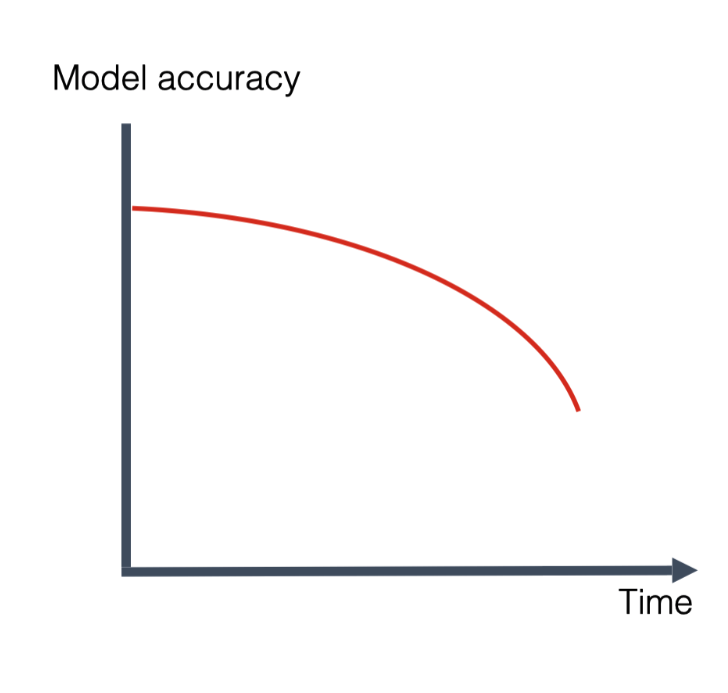

## Data Preparation Phase ##

Initial Quality Check & Cleansing

- Handling Missing Values（NaN, None, Null）

- Handling Duplicates

- Handling Outliers

- Handling Inconsistent Data

Why So Strict?

  Faulty de-identification torpedoes recall, drains labeling budgets, and can leave the model downright unusable during training.

Data Accuracy & Stability Monitoring (Schema / Distribution Drift Metrics)

- Type & Format Drift: Rate of change in field data types or in patterns defined by regular expressions.

- New-Column Ratio: Proportion of newly added columns.

- High-Cardinality New Columns: Newly added columns whose distinct-value count is high.

- Unique-Value Surge: Sudden spikes in the number of unique values.

- Key-Field Missing Rate: Percentage of missing values in critical fields.

## Data Splitting & Cross-Validation ##

1. Random & Stratified Hold-out (80 / 10 / 10 or similar) 

2. Group-Aware (user / document) and Time-Series splits  

3. (Repeated) K-Fold / Stratified K-Fold for small datasets 

## Annotation ##

Use Streamlit to spin up a quick ground-truth labeling platform.(https://github.com/streamlit/streamlit )

**Iteration and validation**

- Small-batch kickoff Label 1–2 customers that differ markedly from each other to trial the workflow and standards.

- Feedback loop Train/validate the model on the labeled data, then inspect which customers and request types still perform poorly. That analysis may trigger a re-evaluation of label accuracy or the addition of new labeled samples.

## Model-Fit Diagnostics ##

### Overfitting & underfitting detection ###
**Overfitting: Training error is low, but testing error is significantly higher.**

1. detect overfitting:

    - loss curves

    - generalization curves

2. overfitting is caused by one or both of the following problems:

    - The training set doesn't adequately represent real life data (or the validation set or test set).

    - The model is too complex.

**Underfitting: Errors are consistently high across training and testing data sets.**

1. detect underfitting:

    - Poor performance on training data: If the model performs poorly on the data it was trained on, it's a strong indicator of underfitting. 

    - Poor generalization: The model also performs poorly on new, unseen data. 

2. causes of underfitting:

    - Too simple of a model:

    Using a model that is too basic for the complexity of the data, like using linear regression for data that is clearly non-linear.

    - Inadequate input features:

    The features used to train the model may not capture the relevant information needed for accurate predictions.

    - Insufficient training data:

    A small training dataset may not provide enough examples for the model to learn the underlying patterns. 

## Model Evaluation ##

1. classification metrics

    **confusion matrix**

    A confusion matrix is a table that summarizes the performance of a classification model by showing the counts of true positive, true negative, false positive, and false negative predictions. It helps visualize how well a model distinguishes between different classes and identifies where the model is making errors. 

|       | Actual positive | Actual negative  |
| :----:        |    :----:   |          :----: |
| Predicted positive      | True positive (TP): A spam email correctly classified as a spam email. These are the spam messages automatically sent to the spam folder.       | False positive (FP): A not-spam email misclassified as spam. These are the legitimate emails that wind up in the spam folder.   |
| Predicted negative   | False negative (FN): A spam email misclassified as not-spam. These are spam emails that aren't caught by the spam filter and make their way into the inbox.        | True negative (TN): A not-spam email correctly classified as not-spam. These are the legitimate emails that are sent directly to the inbox.      |

| Accuracy metric | Description | Formula |
| --- | ----------- | --------------------- |
| Accuracy | the proportion of all classifications that were correct, whether positive or negative. It is mathematically defined as | $\text{Accuracy} = \frac{\text{correct classifications}}{\text{total classifications}} = \frac{TP+TN}{TP+TN+FP+FN}$ |
| true positive rate (TPR) | The true positive rate (TPR), or the proportion of all actual positives that were classified correctly as positives, is also known as recall. | $\text{Recall (or TPR)} = \frac{\text{correctly classified actual positives}}{\text{all actual positives}} = \frac{TP}{TP+FN}$ |
| false positive rate (FPR) | The false positive rate (FPR) is the proportion of all actual negatives that were classified incorrectly as positives, also known as the probability of false alarm.  | $\text{FPR} = \frac{\text{incorrectly classified actual negatives}} {\text{all actual negatives}} = \frac{FP}{FP+TN}$ |
| Precision | the proportion of all the model's positive classifications that are actually positive. | $\text{Precision} = \frac{\text{correctly classified actual positives}} {\text{everything classified as positive}} = \frac{TP}{TP+FP}$ |
| F1 score | the harmonic mean (a kind of average) of precision and recall | $\text{F1}=2*\frac{\text{precision * recall}}{\text{precision + recall}}   = \frac{2\text{TP}}{2\text{TP + FP + FN}}$ |

**Example**
|             | Predicted Not Spam | Predicted Not Spam |
| ----------- | ----------- |--------|
| Actual Spam      | 85       | 15 |
| Actual Not Spam   | 10        | 90 |

- 85 emails were correctly classified as spam (TP).

- 90 emails were correctly classified as not spam (TN).

- 15 emails were incorrectly classified as spam (FP).

- 10 emails were incorrectly classified as not spam (FN). 

Drift

- Data drift：change in model inputs

- Concept drift ： change in input-output relationships

- prediction drift：change in the model outputs

| Types of concept drift      | Description |
| ----------- | ----------- |
| Gradual concept drift      | In production, you can often observe a smooth decay in the core model quality metric over time. The exact speed of this decay varies and heavily depends on the modeled process and rate of change in the environment.       |
| Sudden concept drift   | Imagine that your model processes input data about user interactions in the app to predict the likelihood of conversions and recommend specific content. If you update the application design and add new screens and flows, the model trained on the events collected in the older version will become obsolete.        |
| Recurring concept drift  | For instance, in a sales model, you might notice sales going up during holidays, discount periods, or Black Fridays. Ice cream sales differ by season, and weekends often have different patterns than business days.         |

| Syntax      | The difference | The similarity |
| ----------- | ----------- |-------|
| Data drift VS Concept drift      | Data drift refers to the shifts in input feature distributions, whereas concept drift refers to shifts in the relationships between model inputs and outputs.       | Both data drift and concept drift can result in a decline in model quality and often coincide. In monitoring, data distribution drift can be a symptom of concept drift.      |
| Data drift VS Prediction drift   | data drift refers to the changes in the model input data, while prediction drift refers to the changes in the model outputs.        | both data and prediction drift are useful techniques for production model monitoring in the absence of ground truth and can signal the change in the model environment.       |

| drift detection method| description | Formula | Example | Sensitivity |Symmetric  | use case | returns |
| --- | --- |--- |--- |--- |--- |--- |--- |
| Kolmogorov-Smirnov (K-S) Test | Compares the cumulative distribution functions of two datasets to detect differences in their distributions. | -- | The image below shows an example of the statistic, depicted as a black arrow. |high sensitivity |--- | - Continuous-feature distribution drift.  - Calibration of model-predicted probabilities | - The D statistic ranges from 0 to 1; a larger value means the two distributions have a bigger cumulative-probability gap over some interval. - If the p-value is < 0.05, we'll alert on the drift.|
| Population Stability Index (PSI) | Measures the change in the distribution of a feature over time, often used for categorical features.  |--- |--- |--- |--- |--- |--- |
| --- | --- |--- |--- |--- |--- |--- |--- |
| --- | --- |--- |--- |--- |--- |--- |--- |
| --- | --- |--- |--- |--- |--- |--- |--- |
| --- | --- |--- |--- |--- |--- |--- |--- |
| --- | --- |--- |--- |--- |--- |--- |--- |
| --- | --- |--- |--- |--- |--- |--- |--- |
| --- | --- |--- |--- |--- |--- |--- |--- |
| --- | --- |--- |--- |--- |--- |--- |--- |
| --- | --- |--- |--- |--- |--- |--- |--- |
| --- | --- |--- |--- |--- |--- |--- |--- |

